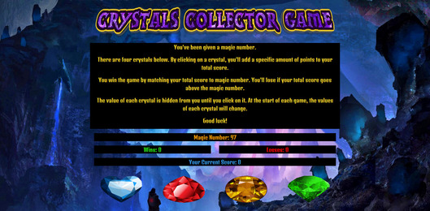

# Crystals Collector Game

## Contributors

kd101jp14

## Technology

* HTML5
* CSS3
* Bootstrap 4
* JavaScript
* jQuery 3

## Live demo:
https://kd101jp14.github.io/crystals-collector-game/

## About

For this game, the user is given a random "magical" number. There are four crystals with hidden values. The user may click on the crystals to find out their values. Each click on a crystal adds its value to the user's score. The goal is to add the values to match the random "magical" number. If the user matches the score to the random number perfectly, the game is won. If the user's score exceeds the magic number, the game is lost. This game contains audio.

### The Challenge:

The primary challenge for this game was getting the crystals to equal different random values and then getting them to add up to create the users score.

To create a solution to this challenge, I created a function to randomly choose an integer, which would serve as the value for a specific crystal. From there, I used if-statements to compare the values of the crystals, in order to avoid repeating values. Last, I created an `updateScore` function within a click function. This way, whenever the user clicked on a crystal, the value of that crystal would be added to the score.

## License

This project does not have a license and is not currently open for contributions. Suggestions are welcome.

## Contact

* Homepage:  https://github.com/kd101jp14

* E-mail: davis.kyra@rocketmail.com
